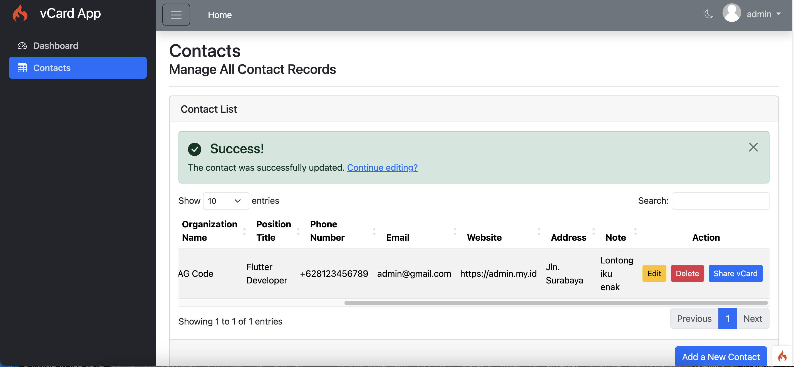
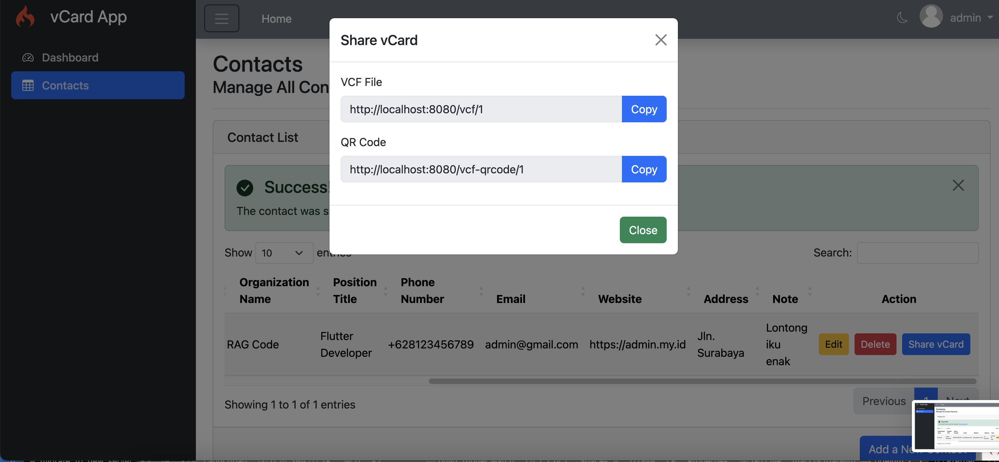

# VCard App




## About VCard App

**VCard App** is a powerful tool designed to manage contact information seamlessly. This application allows you to:

- Save vCards for any contacts.
- Generate QR codes for sharing contact information.
- Export contact data as `.vcf` files from shared links within the app.

Built on **CodeIgniter 4**, this app combines speed, flexibility, and security for an excellent user experience.

More information about CodeIgniter 4 can be found at the [official site](https://codeigniter.com).

## Features

- **vCard Management**: Easily save and update contact information.
- **QR Code Generation**: Quickly create QR codes to share contact details with others.
- **VCF File Export**: Export contacts to `.vcf` format for easy sharing or backup.
- **Link Sharing**: Share a link that lets others access the contact data and generate QR codes or `.vcf` files.

## Installation & Updates

Run the following commands to install the application:

```bash
composer create-project codeigniter4/appstarter vcard-app
cd vcard-app
composer update
```
